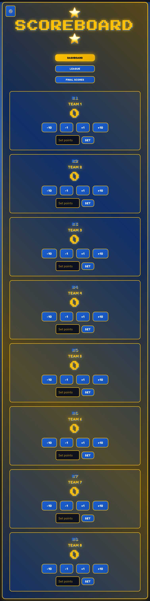

# Scoreboard

A retro arcade-styled scoreboard webapp designed for team games, optimized for widescreen projector display. Built with React and TypeScript, this application provides comprehensive scoring and league management features with a distinctive retro aesthetic.



## Features

### 🎮 Main Dashboard
- **Point Management**: Grant or deduct points with quick actions (+1, +10, -1, -10)
- **Custom Scoring**: Set specific point values for precise score adjustments
- **Team Customization**: Click-to-edit team names for personalized gameplay
- **Live Rankings**: Real-time team rankings with automatic sorting
- **Score Reset**: Quick reset functionality for new games

### 🏆 League Mode
- **8-Team Competition**: Complete round-robin tournament system
- **Simultaneous Games**: 4 games running concurrently per round (7 rounds total)
- **Professional Scoring**: W-L-D system (3 points win, 1 point draw, 0 points loss)
- **Split-Screen Layout**: Games management on left, live standings on right
- **Dynamic Standings**: Real-time updates with top 3 team highlighting
- **Score Integration**: League points automatically sync to main dashboard

### 🏅 Tournament Mode
- **4-Team Brackets**: Single elimination tournament system
- **Semi-Finals & Finals**: Complete bracket structure with winner progression
- **Team Selection**: Choose any 4 teams from the 8-team roster
- **Knockout Format**: Winner advances, loser is eliminated
- **Match Results**: Track wins and display tournament progress

### 📊 Data Management
- **Auto-Save**: Automatic localStorage persistence
- **Export/Import**: JSON file support for data backup and sharing
- **Reset Options**: Individual score or complete data reset
- **Offline Support**: Fully functional without internet connection

### 🎨 Design & Display
- **Retro Arcade Styling**: Pixel-perfect fonts and neon color scheme
- **Projector Optimized**: Designed for widescreen displays (16:9, 21:9 aspect ratios)
- **Distance Viewing**: Large fonts (18px+) and buttons (80px+ width) for 10+ foot viewing
- **High Contrast**: Dark space-themed background with bright cyan/pink accents
- **Responsive Layout**: Adaptive design for various screen sizes

## Installation

### Prerequisites
- Node.js (v16 or higher)
- npm or yarn package manager

### Setup
```bash
# Clone the repository
git clone https://github.com/erclm/scoreboard.git
cd scoreboard

# Install dependencies
npm install

# Start development server
npm run dev
```

## Usage

1. **Dashboard Mode**: Use for general scoring and quick games
   - Edit team names by clicking on them
   - Use point buttons or input custom values
   - View real-time rankings in the sidebar

2. **League Mode**: Perfect for structured tournaments
   - Navigate to League Mode from the main menu
   - Games are automatically scheduled in rounds
   - Record wins, losses, and draws for each game
   - Monitor live standings on the right panel

3. **Tournament Mode**: Ideal for knockout competitions
   - Select 4 teams from your roster
   - Compete in semi-finals and final matches
   - Winner advances to next round automatically
   - View complete tournament bracket

4. **Data Management**: 
   - Scores auto-save automatically
   - Use Export to backup your data
   - Import previous sessions or share data between devices

## Development

### Available Commands
```bash
npm run dev          # Start development server (http://localhost:5173)
npm run build        # Production build with optimization
npm run preview      # Preview production build locally
```

### Technology Stack
- **Frontend**: React 18 with TypeScript
- **Build Tool**: Vite for fast development and optimized builds
- **Styling**: Vanilla CSS with custom retro arcade theme
- **State Management**: React hooks and localStorage
- **Fonts**: Press Start 2P (headers), Space Mono (body)

### Architecture
```
src/
├── components/           # React components
│   ├── Dashboard.tsx    # Main scoring interface
│   ├── LeagueMode.tsx   # League management system
│   ├── TournamentMode.tsx # Tournament bracket system
│   └── FinalScore.tsx   # Results display
├── types/               # TypeScript type definitions
│   └── index.ts        # Team, League, Game, Tournament interfaces
├── utils/               # Utility functions
│   └── storage.ts      # Data persistence logic
├── styles/              # CSS styling
│   └── App.css         # Main stylesheet with retro theme
└── App.tsx             # Application root component
```

## Design Principles

### Projector Optimization
This application is specifically designed for presentation on large screens and projectors:

- **Typography**: Minimum 16px body text, 20px+ for important content
- **Interactive Elements**: Large click targets (minimum 80px width, 70px height)
- **Color Contrast**: High contrast ratios for excellent visibility from distance
- **Layout**: Generous spacing and clear visual hierarchy

### Retro Arcade Aesthetic
- **Color Palette**: Bright cyan (#00c8ff) and hot pink (#ff0080) on deep space backgrounds
- **Typography**: Pixel-perfect fonts reminiscent of classic arcade games
- **Visual Effects**: Subtle animations and retro-futuristic styling
- **User Experience**: Nostalgic yet modern interface design

## License

MIT

